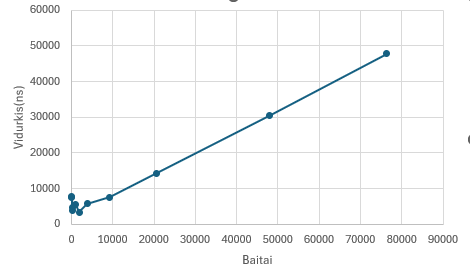

# Custom Hash Function

A custom hash function built from scratch in Java.

## The idea and pseudocode

The hash function produces a fixed-size **32-byte (256-bit)** hash, represented as a 64-character hexadecimal string.

The algorithm works in the following stages:

1. A 32-byte internal state is initialized using a fixed seed.
2. Each input byte is assigned to a state position using `i % 32`.
3. The input byte is XORed with the selected state byte.
4. The resulting state byte is multiplied by a fixed constant.
5. After all input bytes are processed, the state goes through the mixing function.
6. The mixing function is applied **three times**. Each state byte is combined with neighboring state bytes using XOR and multiplication. (Updated in v0.1.1)
7. The final 32-byte state is converted to a 64-character lowercase hexadecimal string.

The algorithm always produces the same hash for the same input.

```text
function HASH(input: byte[]) -> string
    state <- byte[32]
 
    seed <- 293847597
    for i in 0..31:
        seed  <- seed * 28 + i          
        state[i] <- low 8 bits of seed
 
    for i in 0..len(input)-1:
        k <- i mod 32
        state[k] <- state[k] XOR input[i]
        state[k] <- (state[k] * 51) mod 256
 
    repeat 3 times:
        for i in 0..31:
            state[i] <- state[i] XOR state[(i+1) mod 32]
            state[i] <- state[i] XOR state[(i-1) mod 32]
            state[i] <- (state[i] * 51) mod 256
 
    return lowercase hex of state, 2 digits per byte
```

## Input

* Manual text input is encoded using **UTF-8**.
* Files are hashed using their **exact raw bytes**.
* Uppercase and lowercase characters are treated as different input.
* Newline characters are preserved when hashing files.
* No trimming or other normalization is performed.
* The file name itself is not hashed; only the file contents are used.
* An empty file is also a valid input and produces a 64-character hash.

For manual input, the entered line is read as text, so the Enter key's line separator is not included in the hashed text. For files, any newline bytes physically present in the file are included in the hash.

## Prerequisites

* Java (JDK, includes `javac`) installed
* Git, to clone this repository

## Setup

Clone the repository:

```bash
git clone https://github.com/RokasTverijonas/Blockchain-1.git
cd Blockchain-1
```

## Run

Compile the source files:

```bash
javac src/Main.java src/MyHash.java
```

Hash a file:

```bash
java Main path/to/file.txt
```

Hash typed input:

```bash
java Main
```

## Testing

The hash function was tested using several experiments.

### 1. Hash format

The output was checked for:

* fixed length of 64 characters;
* hexadecimal characters only;
* different input sizes;
* empty input;
* ASCII and UTF-8 input;
* spaces and newline characters.

All tested inputs produced a valid 64-character hexadecimal hash.

(All files for this experiment are from experiment 1)
### 2. Determinism

The same input (from experiment 1) was hashed multiple times and the results were compared.

The test also used the sequence:

```text
A → B → A
```

The first and second hashes of `A` were identical, showing that previous hash calculations do not affect later calculations.

```text
A1: feb5b983e107edcda007fcda8e7703d761633fb5b507799dfad3ba684d8b1360
B : e9eeab6c50c1015deef728577b37c896c38d3a50028cbfcde3908bb1709df8d3
A2: feb5b983e107edcda007fcda8e7703d761633fb5b507799dfad3ba684d8b1360
```

### 3. Efficiency

Timing is of the hash computation only, including the hex conversion, and excludes file reading and printing. Each size: 10 warm-up calls, then 5 measurements of 1,000 calls each, divided by 1,000.

The results were:

| Lines | Bytes | Average (ns) | Minimum (ns) | Maximum (ns) |
| ----: | ----: | -----------: | -----------: | -----------: |
|     1 |    71 |       7869.7 |       2785.0 |      15141.1 |
|     2 |   125 |       7470.8 |       5623.2 |       8832.2 |
|     4 |   209 |       4745.3 |       4328.8 |       5330.3 |
|     8 |   370 |       4019.7 |       3279.3 |       5194.6 |
|    16 |  1012 |       5451.7 |       2980.6 |       7811.1 |
|    32 |  1873 |       3445.3 |       3229.6 |       3642.9 |
|    64 |  3776 |       5746.4 |       5019.4 |       6577.0 |
|   128 |  9283 |       7669.5 |       7597.9 |       7772.4 |
|   256 | 20665 |      14303.0 |      14059.2 |      14633.8 |
|   512 | 47946 |      30403.5 |      29655.3 |      31583.3 |
|   789 | 76384 |      47820.8 |      46387.7 |      49407.2 |


Graph:



The execution time generally increased with input size, although small inputs showed normal timing fluctuations.

### 4. Collision testing

Random ASCII inputs were tested with lengths of:

* 10 characters;
* 100 characters;
* 500 characters;
* 1000 characters.

For each length, **100,000 pairs** of random inputs were tested.

The results were:

| Input length | Pair collisions | Groups with collisions |
| -----------: | --------------: | ---------------------: |
|           10 |               0 |                      0 |
|          100 |               0 |                      0 |
|          500 |               0 |                      0 |
|         1000 |               0 |                      0 |

A separate structured-input test used 9 deliberately selected inputs, including different character orders and repeated characters.

Result:

```text
Structured inputs: 9
Collisions: 0
```

No collisions were detected in the tested inputs.

These results only describe the tested inputs and do not prove that the hash function is collision-free.

### 5. Avalanche testing

The avalanche test generated random ASCII strings and changed exactly one character in each pair.

For each pair, both bit-level and hexadecimal-character differences were measured.

With the mixing function applied three times, the results were:

| Input length | Min bit % | Max bit % | Average bit % | Min hex % | Max hex % | Average hex % |
| -----------: | --------: | --------: | ------------: | --------: | --------: | ------------: |
|           10 |       0.4 |      73.0 |         33.64 |       1.6 |     100.0 |         72.68 |
|          100 |       0.4 |      67.2 |         36.13 |       1.6 |     100.0 |         76.89 |
|          500 |       0.4 |      68.4 |         36.18 |       1.6 |     100.0 |         76.97 |
|         1000 |       0.4 |      67.2 |         36.28 |       1.6 |     100.0 |         77.18 |
|      **All** |   **0.4** |  **73.0** |     **35.56** |   **1.6** | **100.0** |     **75.93** |

The additional mixing improved the avalanche results compared with the previous version of the algorithm.

The average bit difference increased from:

```text
1× mixing: 28.11%
3× mixing: 35.56%
```

The average hexadecimal-character difference increased from:

```text
1× mixing: 57.37%
3× mixing: 75.93%
```

The average bit difference is still below 50%, so the algorithm does not produce an ideal avalanche effect. However, applying the mixing function multiple times increased the observed diffusion in these tests.

### 6. Salt experiment

A brute-force experiment was performed using the 4-digit input:

```text
5293
```

The experiment tested all 10,000 possible four-digit candidates.

Without a salt, the target was found after:

```text
5294 attempts
```

A random salt was then appended to both the target and candidate inputs.

The salt used in the experiment was:

```text
PzUA7uZwY3ux
```

With the salt, the target was also found after:

```text
5294 attempts
```

The experiment demonstrates that adding a known salt does not prevent brute-force search when the attacker knows the salt and the possible input space is very small.

The timing results were:

| | Without salt | With salt (`PzUA7uZwY3ux`) |
| --- | ---: | ---: |
| Attempts until first match | 5294 | 5294 |
| Total attempts | 10000 | 10000 |
| Time until first match | 30.1 ms | 15.9 ms |
| Total time | 47.2 ms | 27.5 ms |
| Matching candidates | `[5293]` | `[5293]` |

The timing difference is dependent on the execution environment and is not used as a security measurement.

### Secret Randomness

For H(input || r), if r is initially unknown, the search space becomes larger because both the input and possible r values must be considered. After r is revealed, anyone can verify the commitment by computing H(input || r) and comparing it with the original hash.

## Comparison

v0.2 will be evaluated with the same inputs, seed (`283`), alphabet, sample sizes and environment as above, and compared with v0.1.1.


