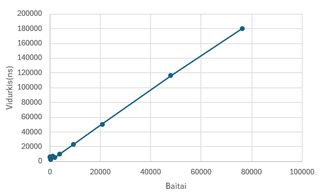

# V0.2 Version

A custom hash function built from scratch in Java with AI-assitance.

> **v0.2 is the AI-assisted version** (made with Claude, by Anthropic). The original version is v0.1.1. Both were tested with the same tests).

## The idea and pseudocode

The hash is **256 bits**, shown as a 64-character hex string. The internal state is **eight 32-bit words**.

1. **Init:** the state starts from 8 fixed constants.
2. **Absorb:** each input byte is XORed into word `i % 8`, multiplied by an odd constant, rotated, and added into the next word.
3. **Length:** the input length is mixed into the state.
4. **Mix:** 16 rounds of add, rotate, XOR, multiply and shift on every word.
5. **Output:** the 8 words are written as 64 lowercase hex characters.
   The same input always gives the same hash.

```text
MUL <- 0x9E3779B1          (odd constant)
 
function HASH(input: byte[]) -> string
    state <- copy of INIT  (8 words of 32 bits)
 
    for i in 0..len(input)-1:
        k <- i mod 8
        state[k] <- state[k] XOR input[i]
        state[k] <- rotateLeft(state[k] * MUL, 13)
        state[(k+1) mod 8] <- state[(k+1) mod 8] + state[k]
 
    state[0] <- state[0] XOR len(input)
    state[1] <- state[1] + len(input) * MUL
 
    repeat 16 times:
        for i in 0..7:
            a <- state[i]
            a <- a + (rotateLeft(state[(i+1) mod 8], 7) XOR state[(i+5) mod 8])
            a <- a * MUL
            a <- a XOR (a >>> 15)
            state[i] <- a
 
    return lowercase hex of state, 8 digits per word
```

## Input

* Manual text input is encoded using **UTF-8**.
* Files are hashed using their **exact raw bytes**.
* Uppercase and lowercase characters are treated as different input.
* Newline characters are preserved when hashing files.
* No trimming or other normalization is performed.
* The file name itself is not hashed; only the file contents are used.
* An empty file is also a valid input and produces a 64-character hash.
  For manual input, the entered line is read as text, so the Enter key's line separator is not included in the hashed text. For files, any newline bytes physically present in the file are included in the hash.

## Prerequisites

* Java (JDK, includes `javac`) installed
* Git, to clone this repository
## Setup

Clone the repository:

```bash
git clone https://github.com/RokasTverijonas/Blockchain-1.git
cd Blockchain-1
```

## Run

Compile the source files:

```bash
javac src/Main.java src/MyHash.java
```

Hash a file:

```bash
java Main path/to/file.txt
```

Hash typed input:

```bash
java Main
```

## Testing

The v0.2 hash function was tested using the same experiments as v0.1.1.

### 1. Hash format

The output was checked for:

* fixed length of 64 characters;
* hexadecimal characters only;
* different input sizes;
* empty input;
* ASCII and UTF-8 input;
* spaces and newline characters.

All tested inputs produced a valid 64-character hexadecimal hash.

(All files for this experiment are from experiment 1)

### 2. Determinism

The same input (from experiment 1) was hashed multiple times and the results were compared.

The test also used the sequence:

```text
A → B → A
```

The first and second hashes of `A` were identical, showing that previous hash calculations do not affect later calculations.

```text
A1: 89ee5e0c45674c4600b9fda7ab02a9f039a61cbbb9e143e4d88be6e9a3de9cca
B : d9f9ea3388d954bac2034eaba30b645c8852031e1285fae07831aea167dc944a
A2: 89ee5e0c45674c4600b9fda7ab02a9f039a61cbbb9e143e4d88be6e9a3de9cca
```

### 3. Efficiency

Timing is of the hash computation only, including the hex conversion, and excludes file reading and printing. Each size: 10 warm-up calls, then 5 measurements of 1,000 calls each, divided by 1,000.

The results were:

| Lines | Bytes | Average (ns) | Minimum (ns) | Maximum (ns) |
| ----: | ----: | -----------: | -----------: | -----------: |
|     1 |    71 |       5264.6 |       3982.6 |       7253.1 |
|     2 |   125 |       6494.8 |       4784.6 |       9551.6 |
|     4 |   209 |       3209.8 |       1925.6 |       4517.5 |
|     8 |   370 |       2735.1 |       2629.4 |       2910.2 |
|    16 |  1012 |       7214.1 |       4028.2 |      10424.9 |
|    32 |  1873 |       5356.7 |       5288.8 |       5416.2 |
|    64 |  3776 |       9875.0 |       9646.1 |      10103.1 |
|   128 |  9283 |      23097.7 |      22743.0 |      23747.4 |
|   256 | 20665 |      50707.7 |      49039.8 |      53876.4 |
|   512 | 47946 |     116280.3 |     112306.9 |     120792.3 |
|   789 | 76384 |     180467.6 |     178862.5 |     182493.3 |

Graph v0.2 :



It shows that V0.2 hash is slower, but it was expected because the final mixing does more work.

### 4. Collision testing

Random ASCII inputs were tested with lengths of:

* 10 characters;
* 100 characters;
* 500 characters;
* 1000 characters.
  For each length, **100,000 pairs** of random inputs were tested.

The results were:

| Input length | Pair collisions | Groups with collisions |
| -----------: | --------------: | ---------------------: |
|           10 |               0 |                      0 |
|          100 |               0 |                      0 |
|          500 |               0 |                      0 |
|         1000 |               0 |                      0 |

A separate structured-input test used 9 deliberately selected inputs, including different character orders and repeated characters.

Result:

```text
Structured inputs: 9
Collisions: 0
```

No collisions were detected in the tested inputs.

These results only describe the tested inputs and do not prove that the hash function is collision-free.

### 5. Avalanche testing

The avalanche test generated random ASCII strings and changed exactly one character in each pair.

For each pair, both bit-level and hexadecimal-character differences were measured. For an ideal hash function, about **50%** of the bits and about **93.75%** of the hexadecimal characters are expected to differ.

With 16 mixing rounds, the results were:

| Input length | Min bit % | Max bit % | Average bit % | Min hex % | Max hex % | Average hex % |
| -----------: | --------: | --------: | ------------: | --------: | --------: | ------------: |
|           10 |      38.3 |      61.3 |         49.99 |      78.1 |     100.0 |         93.76 |
|          100 |      36.3 |      62.1 |         50.02 |      79.7 |     100.0 |         93.76 |
|          500 |      35.9 |      62.9 |         50.02 |      73.4 |     100.0 |         93.77 |
|         1000 |      38.3 |      61.7 |         50.00 |      79.7 |     100.0 |         93.74 |
|      **All** |  **35.9** |  **62.9** |     **50.00** |  **73.4** | **100.0** |     **93.76** |

The average bit difference is 50.00% and the average hexadecimal-character difference is 93.76%, essentially the ideal values.

Comparison with v0.1.1 (average difference, same test):

| Input length | v0.1.1 bit % | v0.2 bit % | v0.1.1 hex % | v0.2 hex % |
| -----------: | -----------: | ---------: | -----------: | ---------: |
|           10 |        33.64 |      49.99 |        72.68 |      93.76 |
|          100 |        36.13 |      50.02 |        76.89 |      93.76 |
|          500 |        36.18 |      50.02 |        76.97 |      93.77 |
|         1000 |        36.28 |      50.00 |        77.18 |      93.74 |
|      **All** |    **35.56** |  **50.00** |    **75.93** |  **93.76** |

The worst single pair also improved: minimum bit difference 0.4% in v0.1.1 and 35.9% in v0.2.

### 6. Salt experiment

A brute-force experiment was performed using the 4-digit input:

```text
5293
```

The experiment tested all 10,000 possible four-digit candidates.

Without a salt, the target was found after:

```text
5294 attempts
```

A random salt was then appended to both the target and candidate inputs.

The salt used in the experiment was:

```text
PzUA7uZwY3ux
```

With the salt, the target was also found after:

```text
5294 attempts
```

The experiment demonstrates that adding a known salt does not prevent brute-force search when the attacker knows the salt and the possible input space is very small.

The timing results were:

| | Without salt | With salt (`PzUA7uZwY3ux`) |
| --- | ---: | ---: |
| Target hash | `642f3983447f9ffe547bccc01d96768e2f76ae40dd0ea23b15ebc2cc3404c33c` | `84af8c31f14929e004f56c31c2970ac108520556ffbd463be9f2663604d58ef9` |
| Attempts until first match | 5294 | 5294 |
| Total attempts | 10000 | 10000 |
| Time until first match | 15.7 ms | 11.5 ms |
| Total time | 29.6 ms | 18.6 ms |
| Matching candidates | `[5293]` | `[5293]` |

The timing difference is dependent on the execution environment and is not used as a security measurement.

### Secret Randomness

For H(input || r), if r is initially unknown, the search space becomes larger because both the input and possible r values must be considered. After r is revealed, anyone can verify the commitment by computing H(input || r) and comparing it with the original hash.

## Comparison

v0.2 was evaluated with the same inputs, seed (`283`), alphabet, sample sizes and environment as v0.1.1.

| Test | v0.1.1 (original) | v0.2 (AI version) |
| --- | --- | --- |
| Hash format (64 hex characters) | passed | passed |
| Determinism (A → B → A) | passed | passed |
| Collisions (4 × 100,000 pairs) | 0 | 0 |
| Collisions (9 structured inputs) | 0 | 0 |
| Average bit difference (avalanche) | 35.56% | 50.00% |
| Average hex difference (avalanche) | 75.93% | 93.76% |
| Minimum bit difference (avalanche) | 0.4% | 35.9% |
| Time for 76,384 bytes (average) | 47,820.8 ns | 180,467.6 ns |
| Brute-force of `5293` (attempts) | 5294 | 5294 |
